# SwiggyApp  
This Swiggy application that allows users to order different type of food and also having  features like login/logout, adding food to the cart, selecting locations, and more.

# ***Screenshots*** 

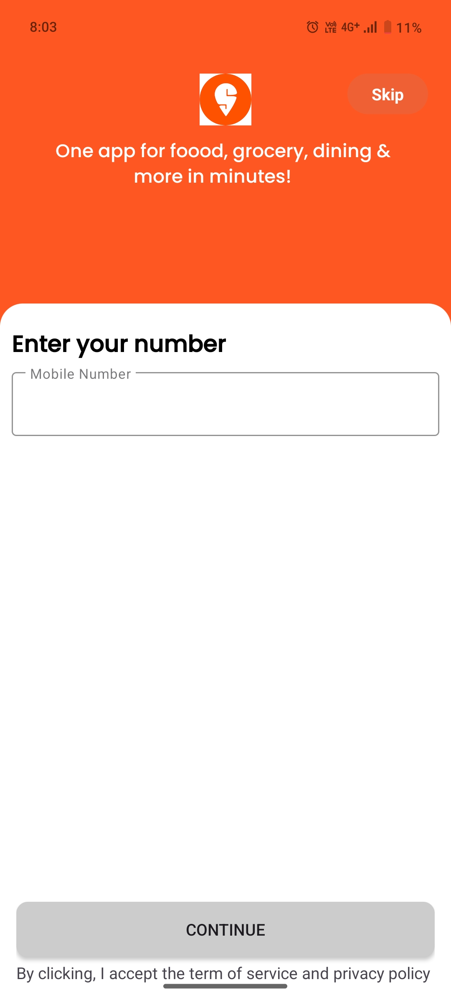 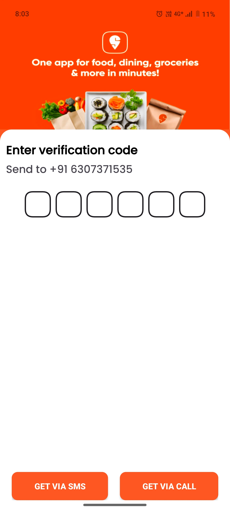 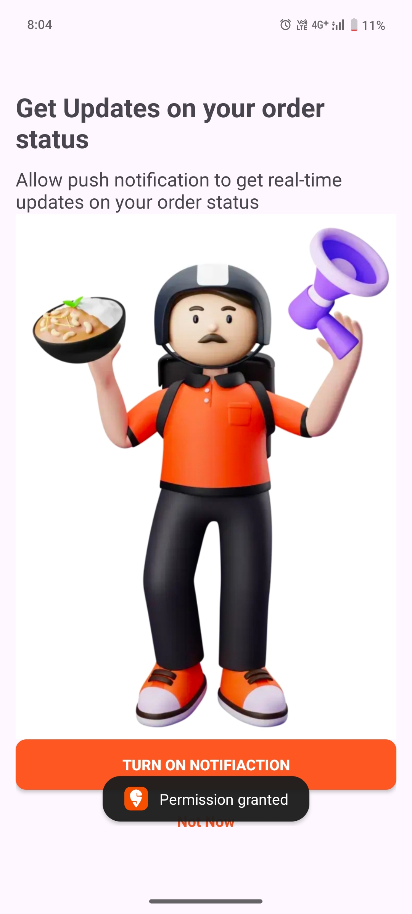 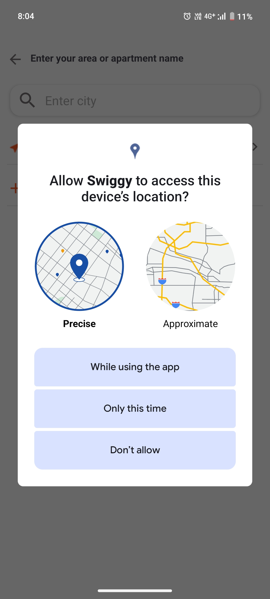

 

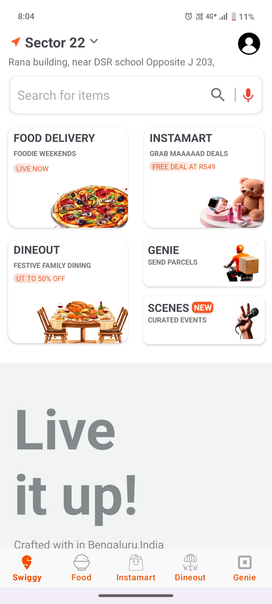 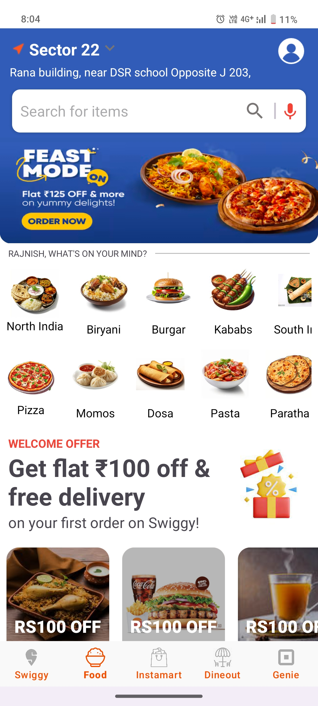 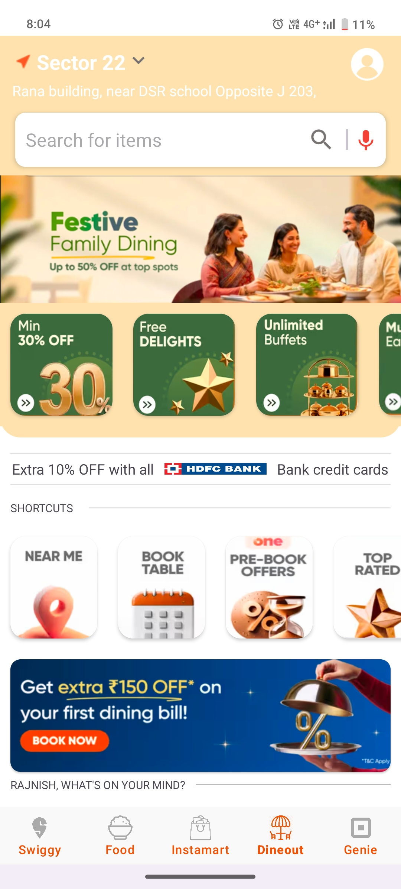 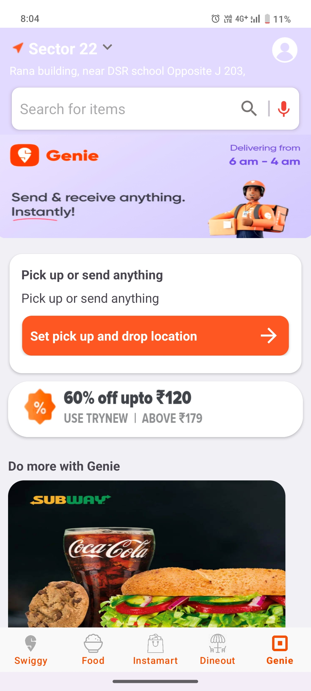

  

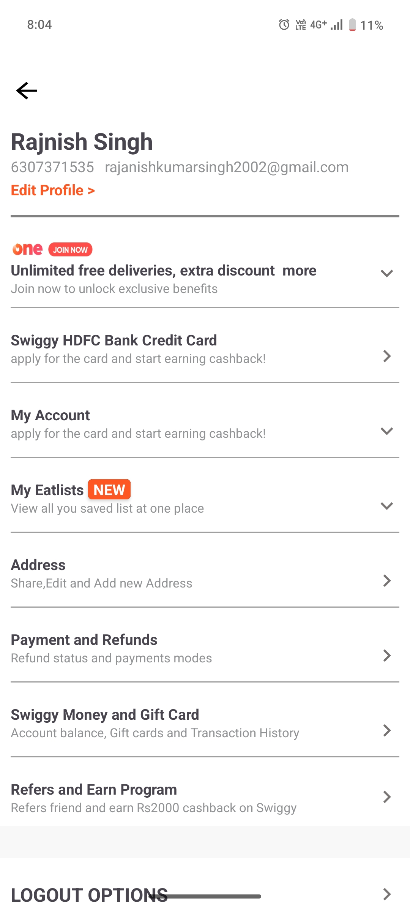 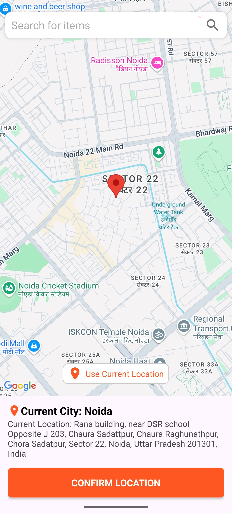 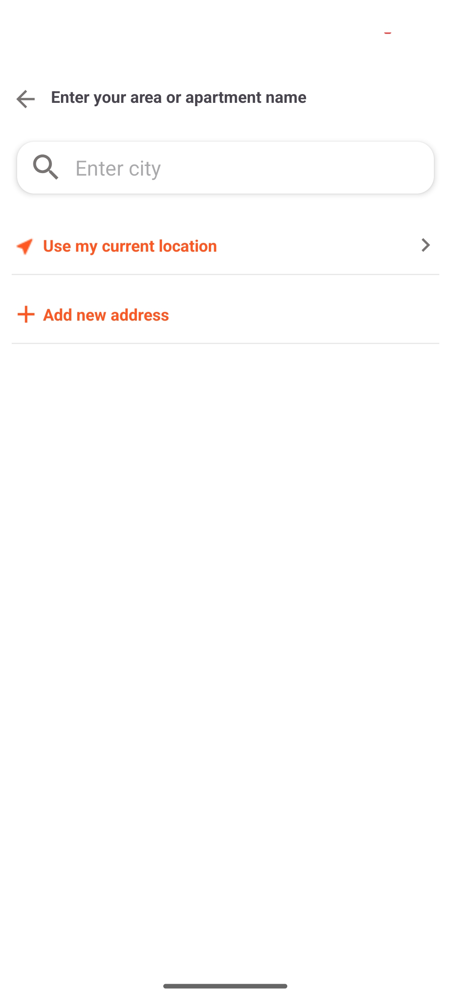 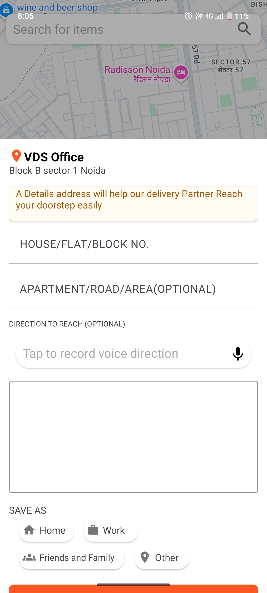
 

# ***Feature*** 
The Notes Android App offers the following features:
-   **User Authentication**  Login/Logout functionality, Option to skip login for guest users.
-   **Location Services:**   Request and manage location permissions, Allow users to select a specific point on the map to add Location.
-   **Add Food to cart:**    Add food items to the cart, View cart with added items and their prices, place an order.

  # ***Technology*** 
-  **Google Maps API**
-  **ROOM Database**
-  **MVVM Architecture**
  
